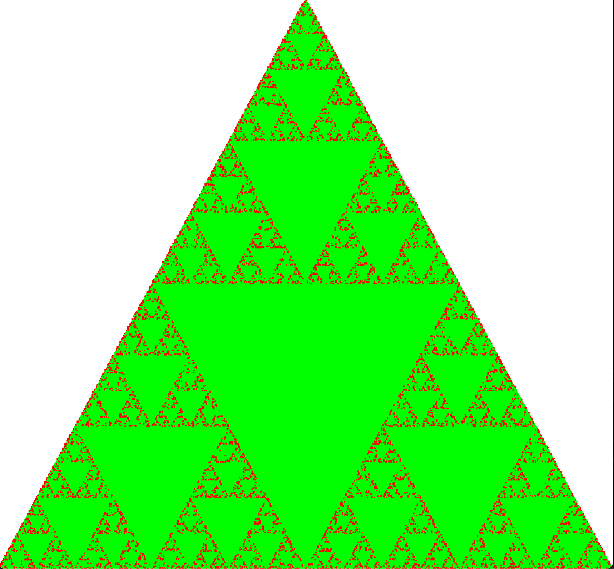

# CG \_Exercises_Setup <!-- omit in toc -->

### Ryo Matsushita

### s1300041 IT-SPR

---


<details>
  <summary>C code here</summary>

```
#ifdef __APPLE__
#include <GLUT/glut.h>
#else
#include <GL/glut.h>
#endif
#include <stdlib.h>
#include <math.h>
#include <stdio.h>

const int N = 1000;
float TriangleDots[N + 2][2];

void LetsFractal(int N) {
    TriangleDots[0][0] = 0.0f; TriangleDots[0][1] = 0.0f;
    TriangleDots[1][0] = 1.0f; TriangleDots[1][1] = 0.0f;
    TriangleDots[2][0] = 0.5f; TriangleDots[2][1] = 1.0f;

    for (int i = 3; i < N + 2; i++) {
        int random = rand() % 3;
        for (int j = 0; j < 2; j++)
            TriangleDots[i][j] = (TriangleDots[i - 1][j] + TriangleDots[random][j]) / 2;
    }
}

void LetsDisplay(float color, int n, int N, int a, int b) {
    glPointSize(color);
    glColor3f(a, b, 0);
    glBegin(GL_POINTS);
    for (int i = n; i < N; i++) glVertex2fv(TriangleDots[i]);
    glEnd();
}

static void display(void) {
    glMatrixMode(GL_MODELVIEW);
    glLoadIdentity();

    // Repaint the background with the color
    // specified by glClearColor()
    glClear(GL_COLOR_BUFFER_BIT);

    LetsFractal(N);
    LetsDisplay(10.0f, 0, 3, 0, 1);
    LetsDisplay(2.0f, 3, N + 2, 1, 0);

    glutSwapBuffers();
}

static void initGL(void) {
    // Set the color for painting the background (White)
    glClearColor(1.0, 1.0, 1.0, 1.0);

    // Set an orthographic projection
    glMatrixMode(GL_PROJECTION);
    glLoadIdentity();
    glOrtho(0.0, 1.0, 0.0, 1.0, -1.0, 1.0);
}

static void keyHandle(unsigned char key, int x, int y) {
    // Exit when ESC is pressed
    if (key == 27) exit(0);
}

int main(int argc, char** argv) {
    glutInit(&argc, argv);
    glutInitDisplayMode(GLUT_DOUBLE | GLUT_RGB);
    glutInitWindowSize(800, 800);
    glutInitWindowPosition(100, 100);
    glutCreateWindow("Setup");

    initGL();

    glutDisplayFunc(display);
    glutKeyboardFunc(keyHandle);
    glutMainLoop();
    return 0;
}
```

</details>


### Result(N = 100)

## 

---

### Result(N = 1000)

## 

---

### Result(N = 10000)

## 

---

### Result(N = 100000)

## 

---
