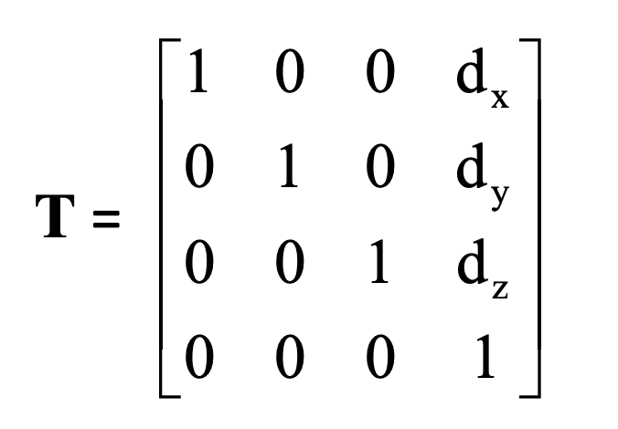
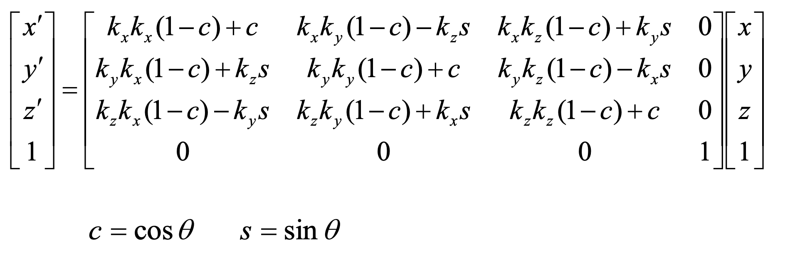
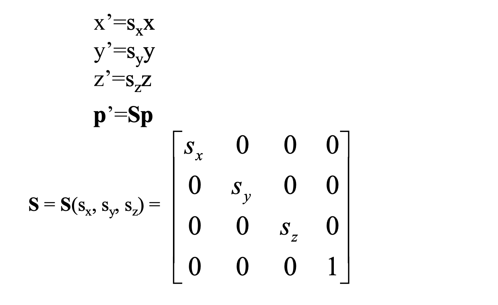

# CG ex2_3D viewing
 <!-- omit in toc -->

### Ryo Matsushita

### s1300041 IT-SPR

---

## Task1 Draw multiple icosahedrons
<details>
  <summary>code(void drawRecursiveIcosahedron)</summary>

```

static void drawRecursiveIcosahedron(int level) {
    if (level == 0) return;
    drawIcosahedron();

    // Prepare for the next
    for (int i = 0; i < 2; i++) {
        float num = (i == 0) ? 1.0f : -1.0f;
        glPushMatrix();
        myTranslatef(num * 1.0f, -1.5f, 0.0f);
        myScalef(SCALE_FACTOR, SCALE_FACTOR, SCALE_FACTOR);
        drawRecursiveIcosahedron(level - 1);
        glPopMatrix();
    }
}
```

</details>
You can increase/decrease Icosahedrons by changing recursive level.

### Result(N = 3)


---

### Result(N = 5)


---

## Task2 Implement the transformations

Followings are code I implemented instead of relying on the functions provided by the fixed-function pipeling of OpenGL.

<br>

You can easily switch between OpenGL implementation and mine.


---

## void myTranslatef(GLfloat x, GLfloat y, GLfloat z)
  
<details>
  <summary>code</summary>
 
```
 
void myTranslatef(GLfloat tx, GLfloat ty, GLfloat tz) {
    GLfloat m[16] = {
        1.0, 0.0, 0.0, 0.0,
        0.0, 1.0, 0.0, 0.0,
        0.0, 0.0, 1.0, 0.0,
        tx, ty, tz, 1.0
    };
    glMultMatrixf(m);
}

```
</details>
Reference


---

## void myRotatef(GLfloat theta, GLfloat kx, GLfloat ky, GLfloat kz)
  
<details>
  <summary>code</summary>
 
```
void myRotatef(GLfloat theta, GLfloat kx, GLfloat ky, GLfloat kz) {
    GLfloat c = cos(theta * _PI / 180.0);
    GLfloat s = sin(theta * _PI / 180.0);
    GLfloat len = sqrt(kx * kx + ky * ky + kz * kz);

    if (len != 0.0f) {
        kx /= len;
        ky /= len;
        kz /= len;
    }

    GLfloat m[16] = {
        kx * kx * (1 - c) + c,        ky * kx * (1 - c) + kz * s, kz * kx * (1 - c) - ky * s, 0.0,
        kx * ky * (1 - c) - kz * s,   ky * ky * (1 - c) + c,      kz * ky * (1 - c) + kx * s, 0.0,
        kx * kz * (1 - c) + ky * s,   ky * kz * (1 - c) - kx * s, kz * kz * (1 - c) + c,      0.0,
        0.0,                          0.0,                       0.0,                       1.0
    };

    glMultMatrixf(m);
}

```
</details>
Reference


---

## void myScalef(GLfloat sx, GLfloat sy, GLfloat sz)

<details>
  <summary>code</summary>
 
```
void myScalef(GLfloat sx, GLfloat sy, GLfloat sz) {
    GLfloat m[16] = {
        sx, 0.0, 0.0, 0.0,
        0.0, sy, 0.0, 0.0,
        0.0, 0.0, sz, 0.0,
        0.0, 0.0, 0.0, 1.0
    };
    glMultMatrixf(m);
}
```

</details>
Reference


---

## void myOrtho(GLfloat left, GLfloat right, GLfloat bottom, GLfloat top, GLfloat near, GLfloat far)

<details>
  <summary>code</summary>
 
```
void myOrtho(GLfloat left, GLfloat right, GLfloat bottom, GLfloat top, GLfloat near, GLfloat far) {
    GLfloat m[16] = {
        2.0 / (right - left), 0.0, 0.0, 0.0,
        0.0, 2.0 / (top - bottom), 0.0, 0.0,
        0.0, 0.0, -2.0 / (far - near), 0.0,
        -(right + left) / (right - left), -(top + bottom) / (top - bottom), -(far + near) / (far - near), 1.0
    };
    glMultMatrixf(m);
}
```
</details>
Reference


---
## void myPerspective(GLfloat fovy, GLfloat aspect, GLfloat near, GLfloat far)

<details>
  <summary>code</summary>
 
```
void myPerspective(GLfloat fovy, GLfloat aspect, GLfloat near, GLfloat far) {
    GLfloat f = 1.0 / tan(fovy * _PI / 360.0);
    GLfloat m[16] = {
        f / aspect, 0.0, 0.0, 0.0,
        0.0, f, 0.0, 0.0,
        0.0, 0.0, (far + near) / (near - far), -1.0,
        0.0, 0.0, (2.0 * far * near) / (near - far), 0.0
    };
    glMultMatrixf(m);
}
```
</details>
Reference


---
## Task2 Implement lookAt
## void myLookAt(float eyeX, float eyeY, float eyeZ, float centerX,,,,)
<details>
  <summary>code</summary>
 
```
void myLookAt(float eyeX, float eyeY, float eyeZ,
              float centerX, float centerY, float centerZ,
              float upX, float upY, float upZ) {
    float forward[3], side[3], up[3];
    float m[16];

    forward[0] = centerX - eyeX;
    forward[1] = centerY - eyeY;
    forward[2] = centerZ - eyeZ;
    up[0] = upX;
    up[1] = upY;
    up[2] = upZ;

    normalize(forward);
    cross(forward, up, side);
    normalize(side);
    cross(side, forward, up);

    m[0] = side[0]; m[4] = side[1]; m[8] = side[2]; m[12] = 0.0;
    m[1] = up[0];   m[5] = up[1];   m[9] = up[2];   m[13] = 0.0;
    m[2] = -forward[0]; m[6] = -forward[1]; m[10] = -forward[2]; m[14] = 0.0;
    m[3] = 0.0;     m[7] = 0.0;     m[11] = 0.0;    m[15] = 1.0;

    glMultMatrixf(m);
    myTranslatef(-eyeX, -eyeY, -eyeZ);
}
```
</details>
You can change the initial eye, center and up by changing parameters bellow.

```
myLookAt(0.0, 0.0, 10.0,  // eye
         0.0, 0.0, 0.0,   // center
         0.0, 1.0, 0.0);  // up
```

[Reference](https://web-int.u-aizu.ac.jp/~fayolle/teaching/cg/pdf/lookat_web.pdf)
