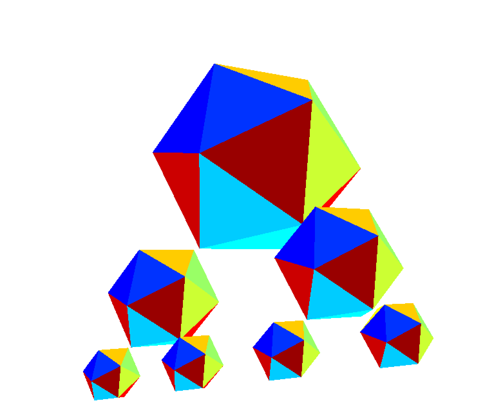
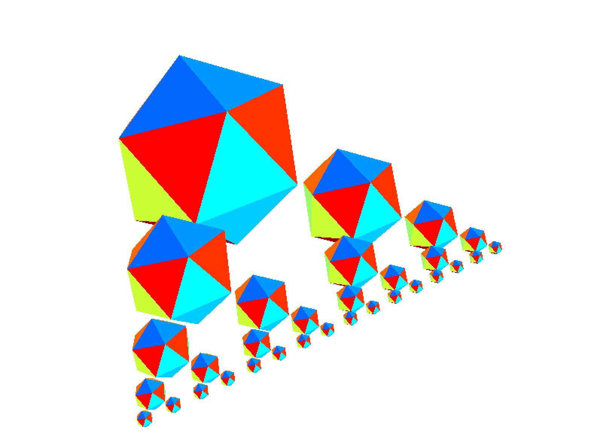

# CG ex2_3D viewing
 <!-- omit in toc -->

### Ryo Matsushita

### s1300041 IT-SPR

---


<details>
  <summary>Full C code here</summary>

```

```

</details>

## Task1 Draw multiple icosahedrons
<details>
  <summary>C code(drawRecursiveIcosahedron) here</summary>

```

static void drawRecursiveIcosahedron(int level) {
    if (level == 0) return;
    drawIcosahedron();

    // Prepare for the next
    for (int i = 0; i < 2; i++) {
        float num = (i == 0) ? 1.0f : -1.0f;
        glPushMatrix();
        myTranslatef(num * 1.0f, -1.5f, 0.0f);
        myScalef(SCALE_FACTOR, SCALE_FACTOR, SCALE_FACTOR);
        drawRecursiveIcosahedron(level - 1);
        glPopMatrix();
    }
}
```

</details>
You can increase/decrease Icosahedrons by changing recursive level

### Result(N = 3)

## 
---

### Result(N = 5)

## 
---
